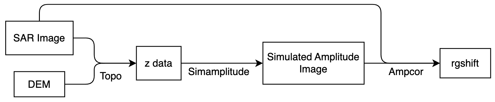

本节将介绍如何实现**SAR影像**与**DEM模拟影像**的振幅匹配



# 1. 生成**z.rdr.full**

`z.rdr.full`是影像坐标系下的DEM数据。在开始处理前，先观察一下ISCE程序本身，找到可以使用的组件。执行`stripmapApp.py --steps --help`可得标准流程：

```bash
...
['startup', 'preprocess', 'cropraw', 'formslc', 'cropslc']
['verifyDEM', 'topo', 'geo2rdr', 'coarse_resample', 'misregistration']
['refined_resample', 'dense_offsets', 'rubber_sheet_range', 'rubber_sheet_azimuth', 'fine_resample']
['split_range_spectrum', 'sub_band_resample', 'interferogram', 'sub_band_interferogram', 'filter']
['filter_low_band', 'filter_high_band', 'unwrap', 'unwrap_low_band', 'unwrap_high_band']
['ionosphere', 'geocode', 'geocodeoffsets', 'endup']
...
```

与`stripmapApp.py`进行比较，找到标准流程对应的具体操作：

```python
...
self.timeStart = time.time()
self.help()
# Run a preprocessor for the two sets of frames
self.runPreprocessor()
#Crop raw data if desired
self.runCrop(True)
self.runFormSLC()
self.runCrop(False)
#Verify whether user defined  a dem component.  If not, then download
# SRTM DEM.
self.verifyDEM()
# run topo (mapping from radar to geo coordinates)
self.runTopo()
# run geo2rdr (mapping from geo to radar coordinates)
self.runGeo2rdr()
# resampling using only geometry offsets
self.runResampleSlc('coarse')
# refine geometry offsets using offsets computed by cross correlation
self.runRefineSecondaryTiming()
# resampling using refined offsets
self.runResampleSlc('refined')
# run dense offsets
self.runDenseOffsets()
...
```

两处的内容是大致相同的。虽然标准流程中没有出现`self.startup()`这一命令，但找到`startup`函数

```python
def startup(self):
    self.help()
    self._insar.timeStart = time.time()
```

可以发现它其实就是标准流程中的前两行。标准流程中，其余步骤的功能大致如下：

- preprocess：通过`applications/make_raw.py`中的函数真正解析SAR影像的内容。主程序`stripmapApp.py`其实只是一个整合包，preprocess的实现位于`$ISCE_HOME/components/isceobj/StripmapProc/runPreprocessor.py`中，且之后大多数步骤的实现都位于这个路径下，只是文件名可能和步骤名不一致；少数步骤的实现在其它模块内。
- cropraw：对原始影像进行裁剪。如果原始影像不是raw而是slc，并且没有regionOfInterest，那么这个步骤会被直接跳过。
- formslc：将raw数据聚焦为slc数据，函数的实现在`runROI.py`中。同样由于现在大多数影像都是slc影像而常常被跳过。
- cropslc：调用的和cropraw其实是一个函数，主要处理regionOfInterest。
- verifyDEM：检查DEM数据是否有效，如果不符合要求就自己下载。下载使用的是`components/contrib/demUtils/DemStitcher.py`中的代码。注意如果一直连接不到官方网站（网络原因或账密不对），最后下载下来的DEM会是空白的，最好用mdx检查一下。
- topo：计算主影像上每个像元投影到WGS84坐标系下的位置，最后调用的是`components/zerodop/topozero/Topozero.py`中的代码。
- geo2rdr：将主影像WGS84坐标投影到辅影像的SAR坐标系下，调用的是`components/zerodop/geo2rdr/Geo2rdr.py`。最后的结果是offsets的形式，方便辅影像直接采样到主影像坐标系下。由于这里仅仅通过几何定位来实现配准，因此配准结果可能是不精确的，称下一步为coarse采样。
- coarse_resample：将辅影像采样到主影像的SAR坐标系下。
- misregistration：这一步骤将主影像和采样后的辅影像进行配准。可能是因为代码直接来源于其他程序的DEM强度模拟影像与SAR影像配准步骤，相关代码注释说是simulated影像与SAR影像的配准。这是不准确的，所有影像都是真实的SAR影像，而且是复数影像。这一步骤实际调用的函数来自`components/isceobj/StripmapProc/runRefineSecondaryTiming.py`。

对于当前案例，`stripmapApp.py`的步骤研究到这里就足够了，已经找到了生成DEM模拟振幅影像的关键步骤：topo。我们通过执行`stripmapApp.py --steps --end=topo`生成`z.rdr.full`。

# 2. 生成DEM模拟振幅影像

由于`stripmapApp.py`流程中不涉及DEM模拟振幅影像，因此必须自己寻找相关的模块。所幸这个模块很显眼，用法也很简单。模块位于`components/isceobj/Util/Simamplitude.py`，具体用法见<a href="./TestSimAmp.py">TestSimAmp.py</a>。

# 3. 影像配准

为了实现SAR影像与DEM模拟影像的配准，我首先研究了如何实现两景SAR影像间的配准。程序见<a href="./TestAmpcor.py">TestAmpcor.py</a>，参照了`components/isceobj/StripmapProc/runRefineSecondaryTiming.py`的写法，对其中一些参数进行了固定。只运行这一个函数，即可将辅影像与主影像进行配准。对两幅SAR影像的配准结果与`stripmapApp.py`的misregistration步骤计算结果一致。下面是这次配准实验的一些细节，介绍了为什么对原始影像而非采样后影像配准时要设置rgoffset = 150

> 如果将原始的辅影像与主影像配准，根据ISCE的计算结果，辅影像与主影像在方位向的offset约为27像素，在距离向的offset约为156像素，而Ampcor的距离向搜索窗口大小只有40，因此必须设置一个150左右的距离向offset初始值。如果将采样后的辅影像与主影像配准，那么因为两方向的offset都小于0，所以不用设置offset初始值。

尽管有些地方提到，还有一种配准方法叫做NStage，但它其实只是不同尺度Ampcor方法的组合，可以参考<a href="./TestNStage.py">TestNStage.py</a>中的参数设置方法。<a href="./TestDenseOffsets.py">TestDenseOffsets.py</a>对应`stripmapApp.py`标准流程中misregistration步骤后的dense_offsets步骤，在本项目中是用不到的。此外，本程序还参考了`components/isceobj/InsarProc/runRgoffset_ampcor.py`。

实现了两景SAR影像配准后，再来看看如何配准SAR影像与DEM模拟振幅影像。<a href="./coregistration.py">coregistration.py</a>实现了这一操作。